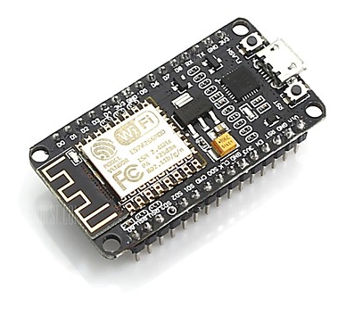

*Guides for the DFRobotshop rover kit*

# Assembly

*Youtube video showing how to put the rover kit together*

# Rover resources

* [PDF Detailed user manual](https://www.robotshop.com/media/files/pdf/dfrobotshop-rover-user-guide.pdf)
* [PDF Schematic](https://www.robotshop.com/media/files/pdf/dfrobotshop-rover-schematic.pdf)
* [ZIP Sample code](https://www.robotshop.com/content/ZIP/dfrobotshop_rover_sample_code.zip)

# Rover Control schemes

All examples below assumes that the rover responds to serial commands w,s,a,d. [See code](tank_wasd_keyboard_control/tank_wasd_keyboard_control.ino)

##  USB Control

_Installation guide_

* Download the Arduino software ZIP file, [Choose JUST DOWNLOAD](https://www.arduino.cc/en/Main/Donate)
* Find the downloaded file in your downloads folder.
* Unpack the ZIP file (Høyreklikk og "Pakk ut alle" på ZIP fila i Downloads mappen)
* Run the Arduino program from the folder you unpakked. (Bonus: Right klick and add a shortcut to your desktop for later use.)
* Copy [all this code](https://raw.githubusercontent.com/KubenKoder/Arduino/master/Egna%20exempel/Rover/tank_wasd_keyboard_control/tank_wasd_keyboard_control.ino)
* Empty the Arduino window and Paste in the code you copied
* Plug in the Rover USB cable to your PC
* Unplug the Bluetooth module from the Rover, it interfears with the programming signals. 
* Under the Tools menu in the Arduion program ("Verktøy?"), find and select the Port, it is called a COM number that changes when you plug things in and out.
* Now find the arrrow button that says Upload when you hover over it, press that one and wait a bit.
* The rover is now programmed.

_Steering the rover via the Serial monitor_

*How to open and configure the serial monitor*

You can steer the rover by sending it these letters:

* W + Enter = Forward
* S + Enter = Reverse
* A + Enter = Steer left
* D + Enter = Steer right
* Spacebar + Enter = Stop

The Rover must be battery powered to run. The switch is ON when toggled towards the center.

## Wireless control
    
### Bluetooth    

There is a [bluetooth module](https://www.robotshop.com/en/dfrobot-serial-bluetooth-module.html#Useful-Links) included in the kit.

To use it, first turn the POWER OFF by pushing the board switch outwards, unplug the USB cable and plug in the Bluetooth module to the board.

#### Android App

The Rover can be controlled via an Android app

* [Android app control](https://www.robotshop.com/community/blog/show/dfrobotshop-rover-tutorial-control-with-android-app-bluetooth)

#### iPhone control - Not possible?

[The DFBluetoothV3 module specifications](https://www.dfrobot.com/product-360.html) state that it uses:

Bluetooth protocol: [Bluetooth Specification v2.0 + EDR](https://en.wikipedia.org/wiki/Bluetooth#Bluetooth_2.0_+_EDR)

Support profiles: [Bluetooth serial port](https://en.wikipedia.org/wiki/List_of_Bluetooth_profiles#Serial_Port_Profile_(SPP))

[Using Bluetooth as a serial port is not supported in iOS](https://support.apple.com/en-us/HT204387)

Conclusion: This module will never work with regular iPhones due to iOS limitations.

#### PC bluetooth control

If your PC has Bluetooth support you can connect to the Bluetooth module in Windows and then steer the Rover through the Arduino serial monitor.

*How to connect to the Bluetooth board in windows*

* IMPORTANT! First close all Arduino Serial monitor windows (the ones there you type the steering commands in.)

* 
* 
* 
* 
* If you can't find it. Check that the "AT Mode" switch on the Bluetooth module is OFF and that the Rover battery pack is turned on.
* 
* 

*The Rover is now paired to your PC and will reconnect automatically when possible, this may block other connections to it*

* 

*You should be able to select it as a port as if you had a USB cable attached*

**NOTE:** *If you have two COM Port choices, sadly only one will work, and it seems to be random which one it is. The "wrong" one will cause the Serial monitor window to freeze when you try to send commands through it. If that happens, press Ctrl+Shift+ESC and force a shut down of the frozen program as the picture below. Then start the Arduino program again and try the other COM port.

* 

*DO THIS IF THE PROGRAM FREEZES!*

* 

**NOTE:** *The BAUD RATE is different when using bluetooth. Make sure to correct it. [Baud = symbols per second](https://en.wikipedia.org/wiki/Baud)

* Now you can steer the Rover via your PC!

**COMMON PROBLEMS**

* If you can't choose any COM port in the Arduino program even if windows says you are connected, you need to restart the PC and try again. 

# Wifi control using esp8266 onboard web server - NOW WORKING

## Description

This mehod gives you a simple web interface to control the [DF RobotShop rover](https://www.robotshop.com/en/dfrobotshop-rover-tracked-robot-basic-kit.html). 

The web page will only be accessable on the local wifi-network, so you will need to connect to the same wifi net with your phone/PC to operate it.

To accomplice this we will use a ESP8266 Wifi-microcontroller module that is Arduino compatible. We'll use the NodeMCU 1.0 board.

The ESP8266 microcontroller will act as a webserver and host a webpage to anyone on the local wireless network. The page will have buttons that makes the microcontroller send the w,s,a,d text commands over serial connection to the Rover through the same pin header as we used for bluetooth.

The webserver will be accessable by entering its ip number in the web browser. The IP will be sent over serial USB to the PC. Or possibly we can connect to it by its mDNS name, but that seems to only work in some cases.

## Programming the module

This is the ESP8266 Wifi-module, it needs to be programmed with the code to run the webpage and send the commands to the rover.

**DRIVERS**
* *If you have admin rights and have installed and not just unzipped the arduino program you can skip this step*
* To connect out PC to it we first need some drivers. [Download them here](../USB%20driver/CP210x_Universal_Windows_Driver.zip)
* To install them you need admin privileges, ask your teacher when you are ready! 

To upload ESP8266 code via the arduino program you need to add support for the EPS first.
* Open the Arduino IDE (the windows program)
* Click on the menu "File -> Preferences".
* In  "Aditional Boards Manager URLs" add **this adress line* to the text box and then click on "OK":
 <code>http://arduino.esp8266.com/stable/package_esp8266com_index.json</code> (don't klick the link)
* In the menu Go to "Tools -> Board -> Boards Manager", type "ESP8266" and install it.
* Go again to "Tools -> Board" and select "NodeMCU 1.0". (It's the type of development board we are using, the same microcontroller can be mounted on many different boards.)
* Copy this [code](../esp8266-nodemcu/Rover_wifi/Rover_wifi.ino) to the Arduino program
* Change the ROVERNAME from "rolf" to something fun. You can use it to find the webpage later.
* Select the correct Tools -> Port COM number and upload as usual.
* **NOTE:** *You can not have the wifi card connected to a powered Rover while programming it. It will get confused as the Rover will start talking to it at the same time.* 
* Restart the ESP8266 module by pressing the tiny reset button on it and then check the serial monitor, **baud 9600**. It should give you the IP nr. Note it down.

Now we know the module can connect to the wireless network.

## Finding the webpage

**Test this before connecting it to the rover to avoid confusion**

* Connect your device (PC or phone) to the wifi network that the Rover is connected to. In our case it's wireless network **"NETGEAR65"** with password **"precioustomato788"**
* Type http://**192.168.0.110** into a web browser, but use the **ip number** that your rover got instead. This might change if you have turned it off a longer time.
* *Alternative adress, sometimes works:* Type http://**rolf**.local into your web browser, but instead of **rolf** use the fun name you gave it in the code. **This worked really well in safari, and sometimes on chrome on an iPhone and never on PC windows**. *Probably my mDNS setup code for the ESP8266 needs to be improved. This would save us future hassle with the IP nr.*
* When then page loads. Click the buttons on the page and look in the Serial monitor, it should display the approriate letters. This is what will be sent to the rover.

Now we know that we can connect to the page **and** we can make it send serial commands like the bluetooth module did.

### Wireing

To connect it to the rover we need four male-female jumper cables. (Or four male-male cables and a breadboard.)

Try to figure out a way to prevent the pins on the module to touch metal on the Rover, perhaps use tape?

The rover will power the wifi module like it did the bluetooth module so you should unplug the USB cable from the module.

**Rover Bluetooth header -> ESP8266**
* GND -> GND
* 5V -> Vin
* Tx -> Rx (transmit to recieve)
* Rx -> Tx (recieve to transmit)

* NC = not connected

### Testing
* Try turning on the rover and accessing the web page using the ip adress. Remember that you need to be connected to the same wireless network. (Network **NETGEAR65"** with password **"precioustomato788"** is the default.) 
* Have fun! 

#### Expanding the webpage

You can edit the code that is uploaded to the ESP8266 and add lines and change the commands as you please.

#### A note about combining different voltage levels

The ESP8266 is a 3.3V volt mircocontroller and the rover is a 5V Arduino so I have made sure they will not get damaged. 

##### My 3.3 V vs 5V Checklist:
* Supply voltage - CHECK, There is a ams1117 5V to 3.3V Linear Regulator on the NODEMCU dev board. Rover outputs ~5V for the bluetooth module. 
* Input Rx voltage - Esp8266 should be 5V input compatible according to tests, see [source](https://hackaday.com/2016/07/28/ask-hackaday-is-the-esp8266-5v-tolerant/) and [source, expressif CEO](https://www.facebook.com/groups/1499045113679103/permalink/1731855033731442/?hc_location=ufi). So we need not worry.
* Output voltage / current draw - Should be ok, Rx input is high impedance and should read >~2V as high. See [source](https://learn.sparkfun.com/tutorials/logic-levels/ttl-logic-levels)

All good, we can connect the ESP8266 3.3V logic pins directly to the arduino 5V pins without fearing damage.

#### Telerobotics bonus idea

If we attach a mobile phone to the rover, we can make a video chat to the phone and see where it drives. 

(Possible extension, use the headset jack to recieve the robot control signals to be able to steer it using computer generated audio signals tied to keystrokes)
