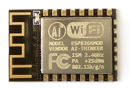
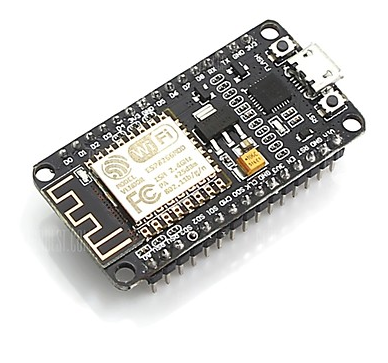
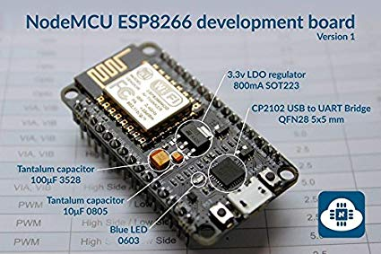
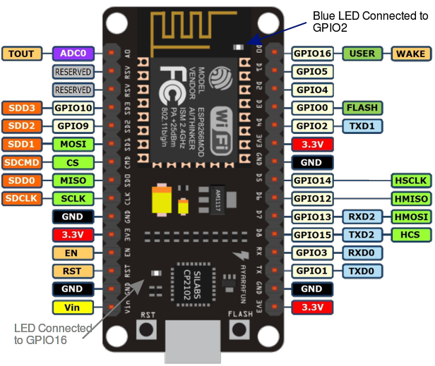
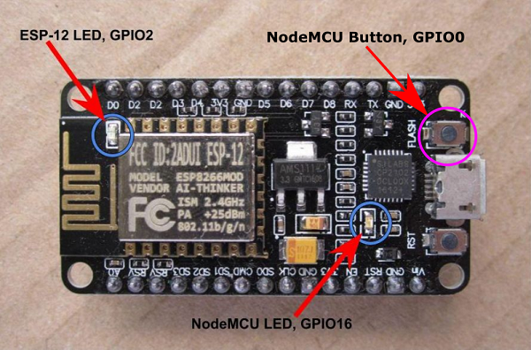
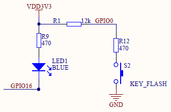

# ESP8266 on NodeMCU dev board

The ESP8266 is a low-cost Wi-Fi microchip with full TCP/IP stack and microcontroller capability produced by manufacturer Espressif Systems in Shanghai, China. [More on wikipedia](https://en.wikipedia.org/wiki/ESP8266)



*ESP8266 by expressif, note the small Wi-fi antenna printed on the board*



*NodeMCU 1.0 development board housing a ESP8266 on top*



*The development board has components that makes it easy to connect to the ESP8266 using USB*



*Pinout of the NodeMCU 1.0 board*

**NOTE!** The Arduino code uses the General Purpose Input / Output pin (GPIO) numbers when assigning pin functions, **not the numbers on the board.** [Pin converter](pins.txt)


*[Source](https://lowvoltage.github.io/2017/07/09/Onboard-LEDs-NodeMCU-Got-Two)*
 
*The board already has two LEDs and a button*



*The button and GPIO16 LED schematic, note that they both activate with a LOW digital signal* 

[Complete schematic](docs/NODEMCU_DEVKIT_V1.0_schematic.PDF)

## Getting started with ESP8266 in the Arduino IDE

*NOTE! I recommend that you change your arduino environment to English before proceeding. To do this, change it in Menu File > Preferences > Editor language.*

1. Follow the [Official installation instruction for using the Board manager](https://arduino-esp8266.readthedocs.io/en/2.5.2/installing.html#boards-manager) 
 * Make sure you go to Tools > Board: ...> Board manager *Note! Board manager is different from the Library manager*
2. In the Arduino program (the IDE), open **Tools > Board** and select **NodeMCU 1.0**
3. In the Arduino program (the IDE), open **Tools > Port** and select **COM**-something. (If you can't see any ports, re-install the arduino program to get the drivers.)
5. Upload this code to test that eveything works

```
#define firstLED 16 //This LED is connected to the pin marked D0 
#define secondLED 2 //This LED is connected to the pin marked D4 (Interferes with serial communication, avoid)

void setup() {
  pinMode(firstLED, OUTPUT);
   pinMode(secondLED, OUTPUT);
}
void loop() {
  digitalWrite(firstLED, LOW);   // Turn the LED on (Note that LOW is the voltage level
  // but actually the LED is on; this is because
  // it is active low on the ESP-01)
  delay(1000);                      // Wait for a second
  digitalWrite(firstLED, HIGH);  // Turn the LED off by making the voltage HIGH
  delay(2000);                      // Wait for two seconds (to demonstrate the active low LED)
}
```
*You can test changing the code to blink the second LED as well*

6. Test this [Button code](button_blink/button_blink.ino) for the built in button (marked FLASH)
7. Now you can start exploring the Wi-fi features of the ESP8266! There are several great examples in the Arduino program. In the Arduino IDE menu: **File > Examples > (Scroll down to NodeMCU 1.0) > ESP8266WebServer > HelloServer** is a good start. [My version](HelloServer_LED/HelloServer_LED.ino)
8. Try adding a webpage that shows how many buttonpresses there has been since the board was reset. Hint: Use button code from **Examples > Digital > StateChangeDetection**

### Further reading
* [ESP8622 Community forum](https://www.esp8266.com/)
* [Arduino Core for ESP8266](https://arduino-esp8266.readthedocs.io/en/2.5.2/)

## 3.3 V vs 5V Compatibillity

The ESP8266 uses 3.3V logic leves and it is directly compatible and can communicate with most sensors and microcontrollers that use 5V logic levels. You can for example make a serial connection directly between an arduino UNO and a ESP8266 without any resistors or voltage level adjusters.

#### Information sources
* [Sparkfun](https://learn.sparkfun.com/tutorials/logic-levels/all)
* [Hackaday](https://hackaday.com/2016/07/28/ask-hackaday-is-the-esp8266-5v-tolerant/) 
* [Expressif CEO confirms on facebook](https://www.facebook.com/groups/1499045113679103/permalink/1731855033731442/?hc_location=ufi) *(PDF backup: [Made 18.10.2019](docs/facebook_5v_expressif.pdf))*

## Current and voltage ratings
* GPIO pin output voltage 3.3V, 5V tolerant signal inputs
* Max GPIO pin current [12mA source](https://www.espressif.com/sites/default/files/documentation/0a-esp8266ex_datasheet_en.pdf) (source = current flows out of pin)
* Max GPIO pin current [~20 mA sink](https://bbs.espressif.com/viewtopic.php?t=139) (sink = current flows into pin)
* Vin input voltage 5V from USB, assume max 500mA if using a generic USB port/charger
* Teoretical max current from 3.3V pin 800mA from onboard regulator (might require cooling)

## Driving external LEDs with the ESP8266

Some online sources claim that you don't need current limiting resistors on the ESP8266, this is a misunderstanding. Don't roast your ESP8266 by skipping over your resistors. [Maximum current test log and discussion](esp8266_high_current.md)

### Example 1: Driving one LED by sinking current (pin LOW = LED on)
* 20 mA sink current limit
* Standard LED with recommended current 20mA (or 0,02A) at 2 Volts
* 3.3V Pin voltage
* 3.3V - 2V = 1.3V too much, let's add a limiting resistor
* U = R * I becomes 1.3V = R * 0,02 gives us R = 65 ohm
**NOTE! This is if we SINK current into the microcontroller**

### Example 2: Driving one LED by sourcing current (pin HIGH = LED on)
* 12 mA source current limit
* We can't drive the LEDs all the way to 20mA! 
* Tests measurements show that a 108 ohm series resistor limits a single LEDs current to around 10mA
* If you use another resistance, verify that the current isn't above 12mA
**NOTE! This works for all single LEDs, regardless of sinking or sourcing**

## Recommended pins

When starting out, use the pins with these markings on the board:

| Pin Marking on board | Pin number in Arduino IDE |
| ------------- | ------------- |
| D1  | GPIO5  |
| D2  | GPIO4  |
| D5  | GPIO14  |
| D6  | GPIO12  |
| D7  | GPIO13  |


When you need more, check the [pin use recommendation table](https://randomnerdtutorials.com/esp8266-pinout-reference-gpios/).

If you are going nuts over the different pin names, try adding this [pin converter](pins.txt) to your program.