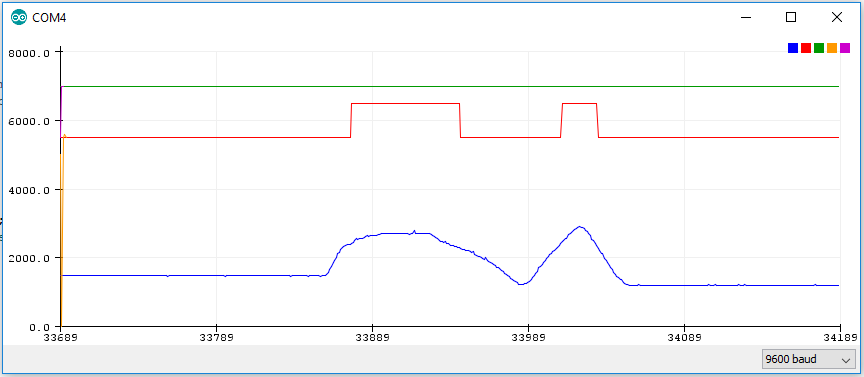

# Pulldown test

* Bygg [button](https://www.arduino.cc/en/tutorial/button) kretsen, anvænd D2 som button pin

DigitalRead måler om spenningen på "Button pin" er høy (5V) eller lav (0V) og gir en 1 eller 0 som svar.

Vi ønsker å måle spenningen på "Button pin" trinnløst (anlogt) med arduinon, dette kan vi gjøre hved å:

* Legg til en kabel mellom A0 (analog ingang) og D2
* Last opp [koden](pulldown/pulldown.ino)
* Slå på Tools > Serial plotter

# Oppgaver og spørsmål
* Prøve knappen mens du ser på grafen. Skjønner du hva som skjer?
* Fjern motstanden og test knappen på nytt. Skjer noe annet?
* Hva sker? Hvorfor?
* Kan du påvirke kretsen uten å trykke på knappen så at signalet blir høy? Hvordan?
* Hvorfor trenger vi nedtrekkningsmotstand?
* (Teoretiskt) Hvorfor kobler vi fra singal pinnen gjennom et motstand og siden til jord istedet for direkte til jord? (HINT: se koblingskjema eller test i tinkercad) 

#Mer Spørsmål
* Hvordan kobler man en opptrekknings-motstand istedet? Tegne koblingskjema og teste
* Finn informasjon om input pullup på [https://www.arduino.cc/](https://www.arduino.cc/) og teste uten ekster motstand, funker det også?
* Finns det noen nackdel/fordel med å bruke pull opp itstedet for pull down?

## Bonusuppgaver
* Kan nedtrekkningsmotstandet bli for stort? Teste?
* Estatt knappen med vridpotentiometer og finn ut ved hvilken spenning den går fra lav til høy signal. Stemmer det med TTL nivåerne? (google)
* Finn ett stort motstand, noe metallobjekt og teste capcaitive touch. [Instruskjon])(https://playground.arduino.cc/Main/CapacitiveSensor/). Finns også masse eksempel på youtube :)

# Bilder

