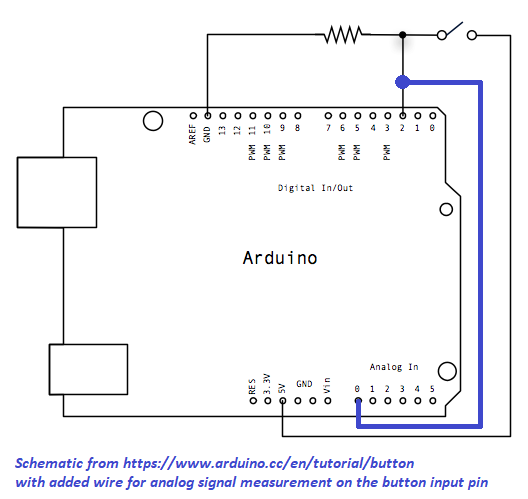
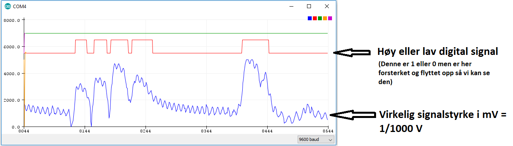
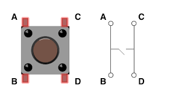

# Pulldown test

Øvelser for å se på støy og signalnivåer for Arduino.

* Bygg [Button](https://www.arduino.cc/en/tutorial/button) kretsen. (Anvænd D2 som button pin.)

DigitalRead måler om spenningen på "Button pin" er høy (5V) eller lav (0V) og gir en 1 eller 0 som svar.

I tillegg ønsker vi å måle spenningen på "Button pin" trinnløst (anlogt) med arduinon, dette kan vi gjøre hved å:

* Legg til en kabel mellom A0 (analog ingang) og D2
* Last opp [koden](pulldown/pulldown.ino)
* I arduinoprogrammet: Slå på Tools > Serial plotter

*Spenning i mV på "Button pin" uten nedtrekkningsmotstand*

*Hvordan brytern er koblet på innsiden. [Bilde fra Mediatech labs](https://docs.labs.mediatek.com/resource/linkit7697-arduino/en/tutorial/smd-buttons)*

# Oppgaver og spørsmål

*Lag individuelle notater med svar på disse. Dere kan godt sammarbete så lenge alle skjønner hva dere kommer frem til.*

* Prøve knappen mens du ser på grafen. Skjønner du hva som skjer?
* Fjern motstanden og test knappen på nytt. Skjer noe annet?
* Hva sker? Hvorfor?
* Kan du påvirke kretsen uten å trykke på knappen så at signalet blir høy? Hvordan?
* Hvorfor trenger vi nedtrekkningsmotstand?
* (Teoretiskt) Hvorfor kobler vi fra singal pinnen gjennom et motstand og siden til jord istedet for direkte til jord? (HINT: Se koblingskjema) 

# Mer Spørsmål
* Hvordan kobler man en opptrekknings-motstand (Pull up) istedet? Lag et koblingskjema og teste å bygge kretsen
* Finn informasjon om input pullup på [https://www.arduino.cc/](https://www.arduino.cc/) og teste uten ekster motstand, funker det også?
* Finner du noen nackdel/fordel med å bruke pull opp itstedet for pull down?

## Bonusuppgaver
* Kan nedtrekkningsmotstandet bli for stort? Teste?
* Bruk en multimeter og mål spenningen på 5V pin, justere koden i map() funksjonen så at plotten blir kablibrert til de verdi som du målt op.
* Estatt knappen med vridpotentiometer og finn ut ved hvilken spenning Arduinon går fra lav til høy signal. 
* Stemmer det med TTL spenningsnivåerne? (Bruk google for å finne hva de er.) 

## Utfordring!
* Finn ett stort motstand, noe metallobjekt og teste capcaitive touch. [Instruskjon])(https://playground.arduino.cc/Main/CapacitiveSensor/). Finns også masse eksempel på youtube :)
* Hvor fungerer capacitive touch? Gjør research på nett! 
