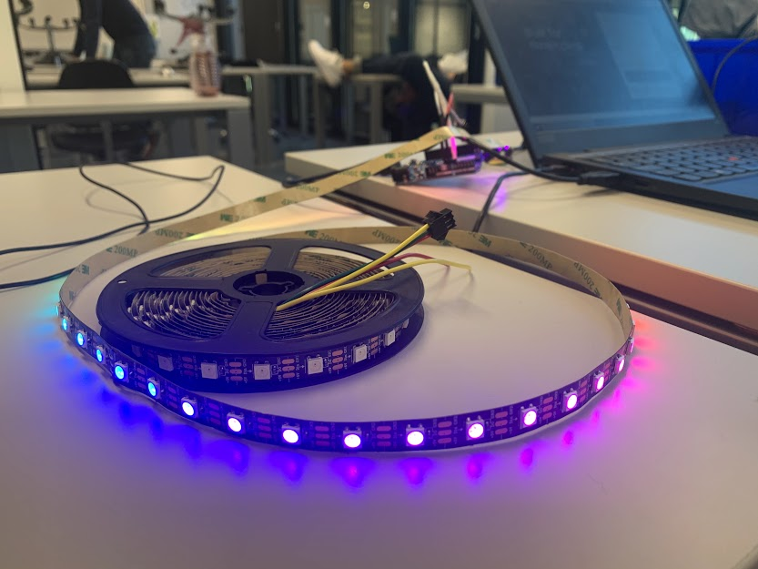

# Adresserbar LED stripe
Hvordan koble opp og programmere en adresserbar LED strip

Vi brukte [denne guide](https://learn.adafruit.com/adafruit-neopixel-uberguide/powering-neopixels) for å finne vilken kondensator vi skulle bruke
