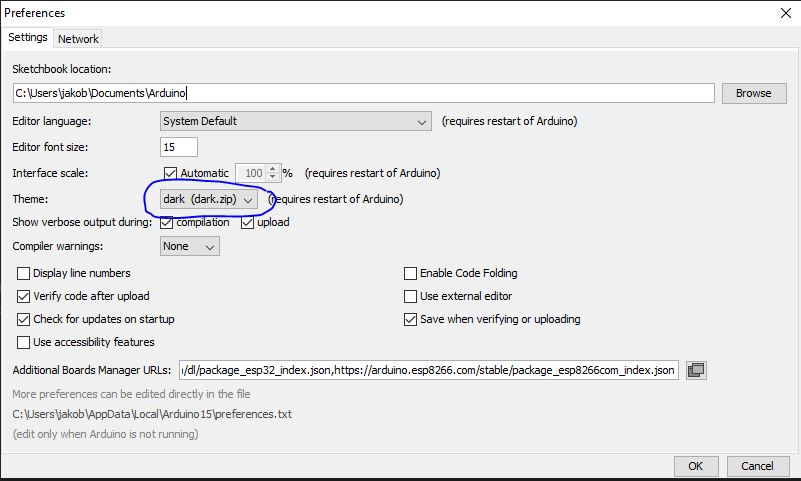

# Arduino

Arduino materialer, eksempler og guider

## Egne eksempler

Arduino eksempelkode endret for å fungere bedre eller oversatt til norsk for å være lettere å forstå.

[Lenke til "Egne eksempler" mappen](Egna%20exempel/)

### Button på Norsk

02 Digital > Button eksemepelet oversatt til norsk. Hvis man skjønner hvordan denne fungerer og kan modifisere den selv så behersker man grunnleggende programmering.

[Med mange kommentarer](Egna%20exempel/Button_Norsk/button_norsk.ino)

[Med få kommentarer](Egna%20exempel/Button_Norsk_Kort/button_norsk_kort.ino)

[Arduino sin Button tutorial](http://www.arduino.cc/en/Tutorial/Button)

### AnalogReadSerial med 0 og 1023 referenser før plot

Bruk denne for å vise hvorfor vi trenger en pull-down resistor på bryter-eksempelet.

[Analog Serial Read med 0](Egna%20exempel/AnalogReadSerial_with_0/AnalogReadSerial_with_0.ino)

### Ping_mod

Et forbedret eksemepl av en Arduino sketch som virker med billige distanse sensorer. Det er basert på sketchen fra Examples | 06. Sensor | Ping og den har en timer som hindrer at sensoren blir stuck.

Den fungerer med både 3 og 4 pins ultrasonic range finder sensorer. Når du bruker 4 pins kombinerer du TRIG og ECHO pinen for å lage en SIG pin.

[Link til koden](Egna%20exempel/Ping_mod/Ping_mod.ino)

Original Ping tutorial med oppkobling: [https://www.arduino.cc/en/Tutorial/Ping](https://www.arduino.cc/en/Tutorial/Ping)

## Jakobs presentations-slides 

Levende dokument som Jakob bruker i automatiseringssystem kursene for 2EL 2019.

[ARDUINO slides](https://docs.google.com/presentation/d/1mvdF-Cz5dpTreEaJTI3VYqD3WL8-uSqXlwQEn87iamg/edit?usp=sharing)

## CH340G driver for Arduino clone

Hvis Arduino chipen ikke blir gjenkjent som en COM port når du plugger den in kan du installere denne driveren først. Installasjonen av driveren krever admin rettigheter på maskinen.

[Last Ned](https://github.com/KubenKoder/Arduino/raw/master/USB%20driver/CH341SER.EXE)

## Arduino NANO

Hvis man bruker de kina-importerte eller pre 2020 Arduino Nano så må man velge "old bootloader"

## Arduino dark theme

1. Legg [denne zip-fil](dark.zip) i *C:\Program Files (x86)\Arduino\lib\theme* mappen
2. Åpne Arduino IDE, i menyen *Fil>Instillninger* bytt till dark-zip og starte om Arduino IDE

*Kilde [jeffThompson DarkArduinoTheme på github](https://github.com/jeffThompson/DarkArduinoTheme)*

