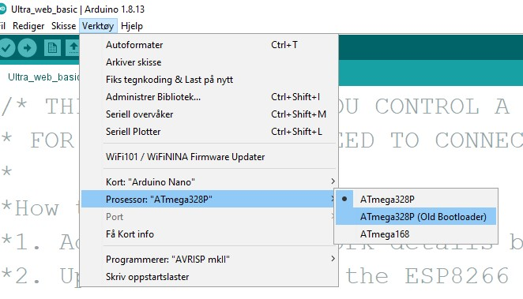

# USB Drivers
These are drivers for the most common USB to serial chips used in microcontroller development boards.

If you install the Arduino IDE (as opposed to just unzipping the files) you will get the option to install the default USB drivers at the same time. 
If you unzipped the Arduino IDE you might be missing drivers. The easiest fix is to dowload and install (with full admin rights)  

* 2019 version of the [CH341SER.EXE](CH341SER_(2019).EXE). This is a popular USB to serial chip used on Chinese versions of popular development boards like the Arduino Nano and UNO. (Alternative: [Official download page in Chinese, very slow](http://www.wch.cn/download/CH341SER_EXE.html)). 
This version of Arduino Nano often needs the "Old bootloader" processor setting for uploading to work, set it to this:

* [CP210x_Universal_Windows_Driver.zip](CP210x_Universal_Windows_Driver.zip) USB to serial chip used on NodeMCU ESP8266 development boards.

## Pirate or bootleg hardware?
There is often misinformed talk about pirate, copied or bootleg versions of popular development boards even when they board schematics are released open source. Arduino releases all their hardware and software under a share alike license. NodeMCU uses the MIT licence that is even more relaxed.
* [Arduino licence](https://www.arduino.cc/en/Main/FAQ#toc3)
* [NodeMCU licence](https://github.com/nodemcu/nodemcu-firmware#license)

